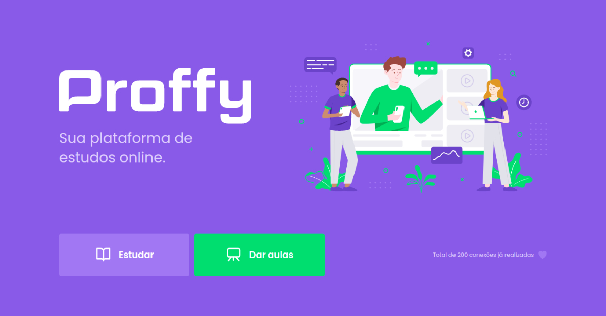
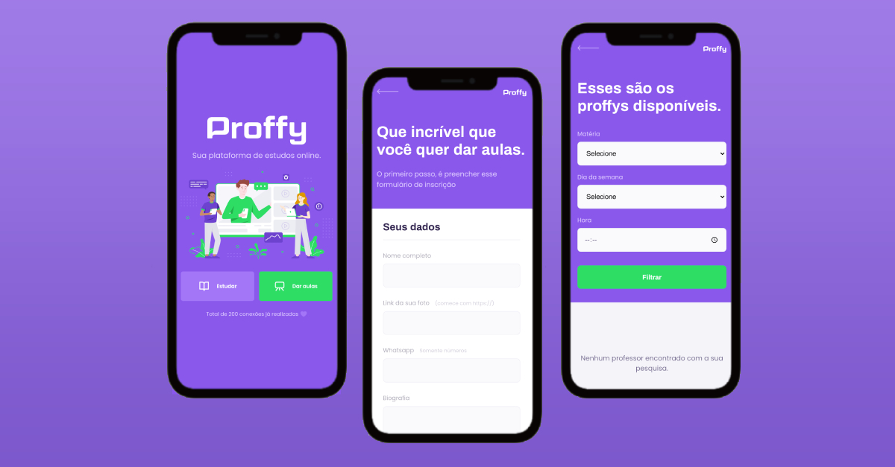

# Proffys

#### :computer: Frontend:
O projeto foi fruto da 2º NextLevelWeek, evento 100% gratuito organizado pela :rocket: [Rocketseat](https://github.com/Rocketseat), onde desenvolvemos a plataforma Proffys, para o encontro de alunos e instrutores. O Frontend foi feito utilizando Html e CSS.

* :heavy_check_mark: É possível realizar um cadastro de aulas.
* :heavy_check_mark: O aluno pode filtrar por tipo de aula oferecida, dias da semana e horário, além disso o aluno poderá entrar em contato com o professor por meio do whatsapp.

#### :computer: Backend:
O Backend foi feito utilizando Nodejs

